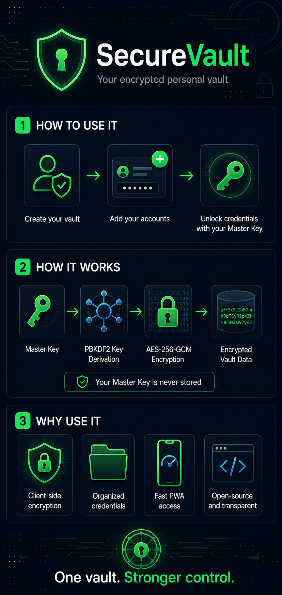

# SecureVault 🔐

[](LICENSE)
[](https://www.php.net/)
[](https://developer.mozilla.org/en-US/docs/Web/API/SubtleCrypto)
[](manifest.json)
[](https://github.com/RonanStack24/SecureVault)

> **SecureVault** is an open-source, zero-knowledge personal password manager built with pure client-side WebCrypto encryption (AES-256-GCM + PBKDF2) and an installable Progressive Web App (PWA) interface.

---

## 🌟 Key Highlights

* 🛡️ **Zero-Knowledge Cryptography**: Master keys and plaintext passwords never touch the server. Cryptographic keys are derived and decrypted exclusively in-memory inside your web browser.
* ⚡ **AES-256-GCM + PBKDF2**: Key stretching with 100,000 iterations of SHA-256 and authenticated Galois/Counter Mode encryption with unique 12-byte initialization vectors (IVs).
* 📱 **Installable Progressive Web App (PWA)**: Install directly to iOS, Android, macOS, or Windows for a fast, native desktop/mobile vault experience with offline asset caching.
* 🧪 **Interactive WebCrypto Playground**: Built-in cryptographic sandbox on the landing page for real-time inspection of client-side key derivation and ciphertext generation.
* 🔎 **Instant Vault Search & Categorization**: Fast client-side filtering by service name, username, or custom categories (Gaming, University, Financial, Work, etc.).
* 🛡️ **Anti-Phishing Safeguards**: Origin validation banners preventing users from falling for unauthorized spoofed clones.

---

## 🏗️ Security Architecture

SecureVault treats the server and database as an **untrusted ciphertext storage layer**.

```
[ User Master Password ] + [ Unique User Salt ]
           │
           ▼ (100,000 Rounds PBKDF2 SHA-256 via WebCrypto)
[ 256-bit AES Cryptographic Key (Held Only in Browser Memory) ]
           │
           ├─► [ Plaintext Credential ] + [ Fresh 96-bit Random IV ]
           │               │
           │               ▼ (AES-256-GCM Local Encryption)
           └─► [ 12-byte IV + Ciphertext + 16-byte Auth Tag ]
                           │
                           ▼ (Transmitted Over TLS / HTTPS)
               [ MySQL Database (Holds Only Ciphertext) ]
```



1. **Key Derivation**: When unlocking the vault, the browser uses the Web Crypto API (`crypto.subtle`) to derive a 256-bit AES key from the master passphrase and user-specific salt.
2. **Local Encryption**: New credentials are encrypted client-side with a unique 12-byte IV before transmission.
3. **Local Decryption**: When viewing passwords, the client fetches the ciphertext and decrypts it in-memory. The plaintext password is never sent to or returned by the server.

---

## 📂 Project Structure

```
SecureVault/
├── .htaccess                 # HTTPS enforcement & security rules
├── .gitignore                # Git exclusions (config.php, database.sql)
├── AGENTS.md                 # Architecture & developer rules
├── README.md                 # Project documentation
├── config.example.php        # Configuration blueprint
├── config.php                # Local/Server configuration (Ignored by Git)
├── database.sql              # Database schema & default categories
├── db.php                    # Database PDO/MySQLi connection singleton
├── auth.php                  # Authentication backend logic
├── accounts.php              # Vault accounts backend logic
├── functions.php             # WebCrypto & cryptographic helpers
├── index.php                 # Official Product Landing Page & Sandbox
├── login.php                 # Master Gateway (Sign In / Account Creation)
├── dashboard.php             # Vault Application Dashboard
├── maintenance.php           # 503 Scheduled Maintenance View
├── manifest.json             # PWA Web App Manifest
├── service-worker.js         # Service Worker (Cache v8)
├── logo.svg, icon-*.png      # App graphics and touch icons
├── api/                      # AJAX Backend API Endpoints
│   ├── accounts.php          # Vault CRUD operations
│   └── auth.php              # Session & login handlers
├── css/                      # Stylesheets
│   └── style.css
└── js/                       # Active Frontend Scripts
    ├── dashboard.js          # WebCrypto encryption engine & UI logic
    └── pwa.js                # Service worker registration & install prompts
```

---

## 🚀 Getting Started (Local Setup)

### Prerequisites
* **PHP**: `8.0` or higher (with `openssl` and `mysqli` extensions enabled)
* **Web Server**: Apache / Nginx (or [XAMPP](https://www.apachefriends.org/))
* **Database**: MySQL 5.7+ or MariaDB 10.3+

### Step-by-Step Installation

1. **Clone the Repository**:
   ```bash
   git clone https://github.com/RonanStack24/SecureVault.git
   cd SecureVault
   ```

2. **Configure Database**:
   * Create a new MySQL database named `securevault`:
     ```sql
     CREATE DATABASE securevault;
     ```
   * Import the schema:
     ```bash
     mysql -u root securevault < database.sql
     ```

3. **Setup Configuration**:
   * Copy `config.example.php` to `config.php`:
     ```bash
     cp config.example.php config.php
     ```
   * Update database credentials and site URL in `config.php`:
     ```php
     define('DB_HOST', 'localhost');
     define('DB_USER', 'root');
     define('DB_PASS', '');
     define('DB_NAME', 'securevault');
     define('SITE_URL', 'http://localhost/SecureVault/');
     define('MAINTENANCE_MODE', false);
     ```

4. **Launch Application**:
   * Start Apache and MySQL in your XAMPP Control Panel.
   * Open your browser and navigate to `http://localhost/SecureVault/`.

---

## 🌐 Production Deployment (e.g. InfinityFree / Shared Hosting)

1. Upload project files to the root web folder (e.g. `htdocs/`).
2. Import `database.sql` into your hosting database via phpMyAdmin.
3. Configure `config.php` with your remote database credentials and set `ENVIRONMENT` to `'production'`.
4. Ensure `.htaccess` is present to enforce **HTTPS** (Web Crypto API requires a secure HTTPS origin).

---

## 🔒 Security Best Practices

* **Master Password Choice**: Choose a strong master key (minimum 12+ characters with mixed case, numbers, and symbols).
* **Zero Recovery Backdoor**: Because SecureVault is zero-knowledge, forgotten master keys cannot be reset or recovered by server administrators.
* **HTTPS Requirement**: Always deploy SecureVault behind TLS/HTTPS in production.

---

## 📄 License & Credits

* **Author**: Developed by **Ronan Antoque** ([@RonanStack24](https://github.com/RonanStack24))
* **License**: Released under the [MIT License](LICENSE).
